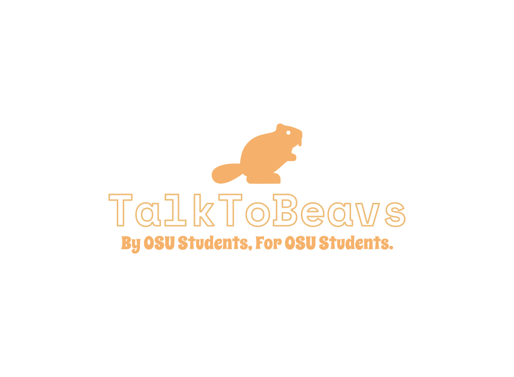

<h1 align="center">

<p align="center">
	
	
	
	
      
	
</p>
	
</h1>

<!-- End header --->

<p align="center" style="font-size:20px;">
	<h3 align="center">🦫 Welcome to the official repository for TalkToBeavs! 🦫 </h3>
	<br>
	<p align="center"
	<i align="center"> TalkToBeavs is a social media application that allows Oregon State University students to connect with each other and chat in real-time. Users can create and join their own rooms to chat with other beavs in Video or Text chat.
	<br><br>Users can post messages and share GIFs from Giphy on the feed. Users can upvote and downvote posts on the feed to signify their liking/dislike of a post. Users can also follow other beavs to see their posts, as well as edit their profile.</i>
      <br>
	<br>
	<h3 align="center">TalkToBeavs was made with ♡ by: <br> <a href="https://github.com/Nyumat">@nyumat</a>  <a href="https://github.com/artkolpakov">@artkolpakov</a> <a href="https://github.com/hannacol">@hannacol</a> <a href="https://github.com/solderq35">@solderq35</a></h3>
	<br>
      <h3 align="center">
	🚀  This Project has been deployed <a href="https://talktobeavs.onrender.com">here</a> 🚀  </h3>
	</p>
</p>
<h1></h1>
<!-- End welcome --->

<h1 align="center">Getting Started</h1>


<h2>How to run the project locally:</h2>

1. Clone the repository
2. Install dependencies
3. Get environment variables
4. Run the project

<h3>1. Clone the repository</h3>

```bash
git clone https://github.com/osu-cs494-w23/TalkToBeavs.git
```

<h3>2. Install the dependencies</h3>

```bash
cd TalkToBeavs
cd frontend
npm install
cd ..
npm install
```

<h3>3. Get environment variables</h3>

```bash
# Create a .env.local file in the root directory
touch .env.local

# Your .env.local file should look like this:
PORT=
MONGODB_URI=
FEED_ID=
JWT_PRIVATE_KEY=
GIPHY_API_KEY=

# Don't forget to add your own values!
```

<h3>4. Run the project</h3>

```bash
# Run the frontend
cd frontend
npm run dev

# Run the backend
cd TalkToBeavs (root directory)
npm run dev
```
<h1></h1>

<h2>TalkToBeavs is proud to be built with:</h2>

- [React](https://react.dev/)
   - JavaScript library for building user interfaces
- [MongoDB](https://www.mongodb.com/)
   - NoSQL document database
- [Vite](https://vitejs.dev/)
   - Fast and lightweight development server
- [Socket.io](https://socket.io/)
   - Real-time communication between users
- [Redux Toolkit](https://redux-toolkit.js.org/)
   - Manage state and data flow between components
- [Express](https://expressjs.com/)
   - Web framework for Node.js
- [WebRTC](https://webrtc.org/)
   - Peer-to-peer video and audio communication
- [Chakra UI](https://chakra-ui.com/)
   - React component library for styling
- [React Router](https://reactrouter.com/)
   - Manage client-side routing and navigation	
- [Giphy API](https://developers.giphy.com/)
   - Search and share GIFs
